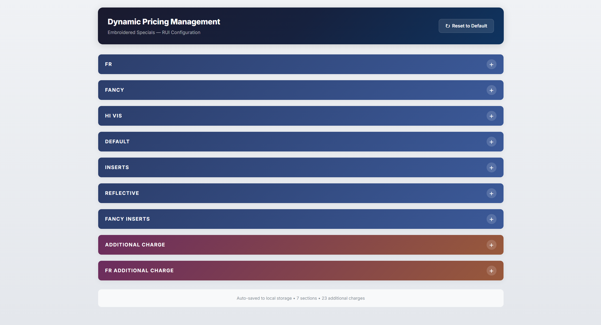
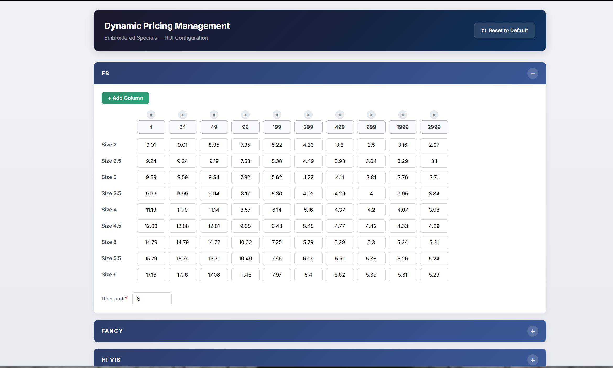
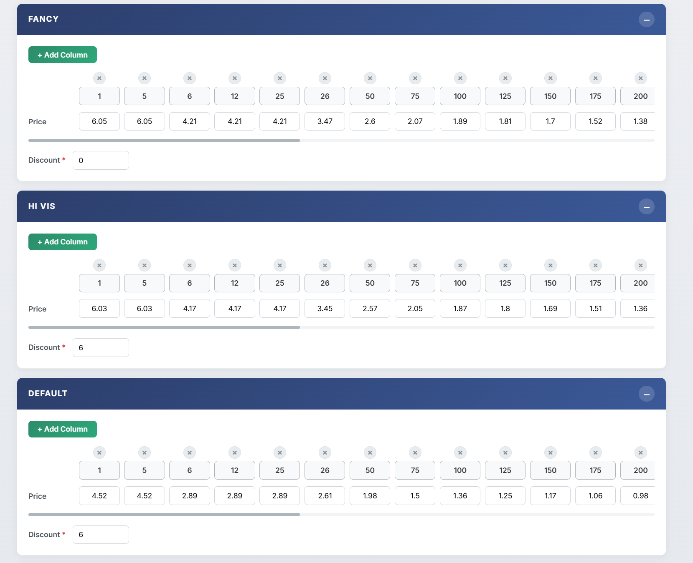
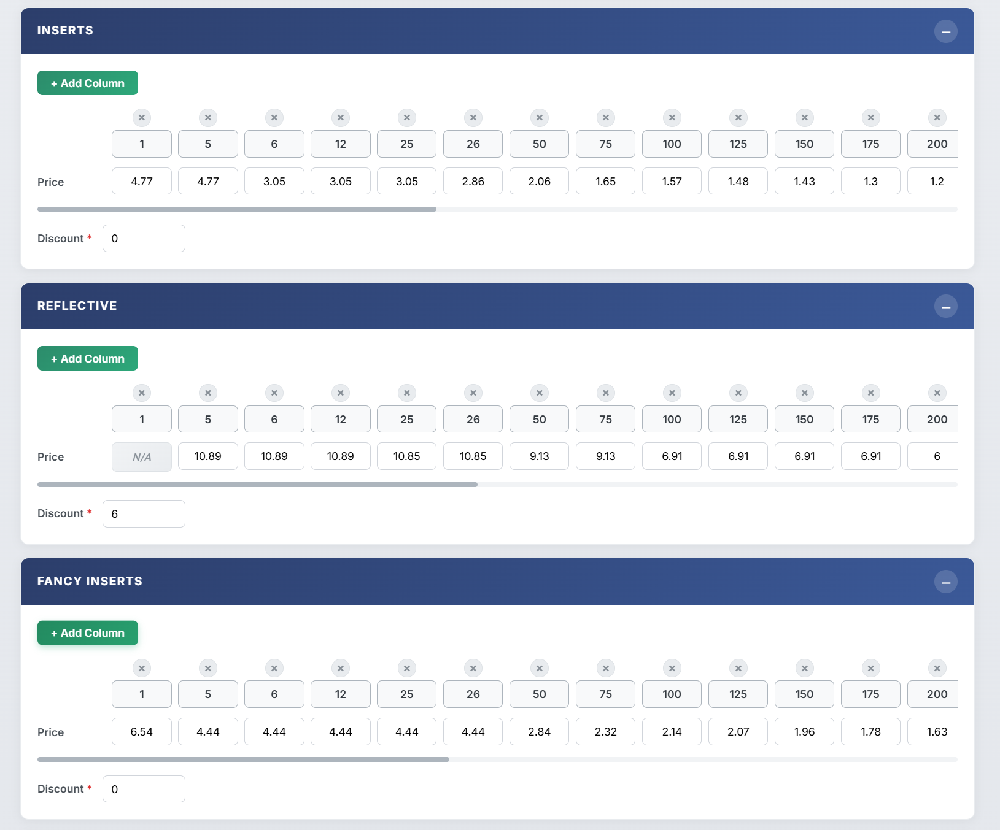
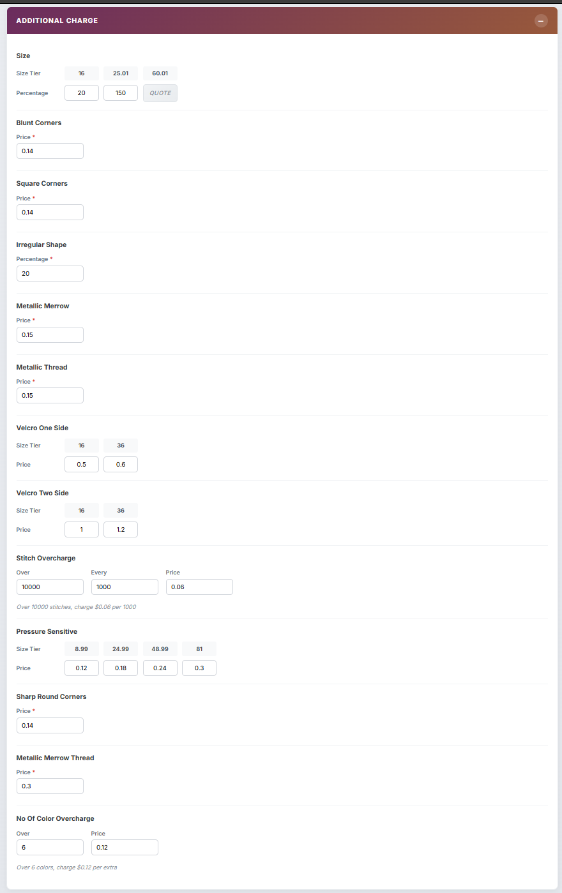
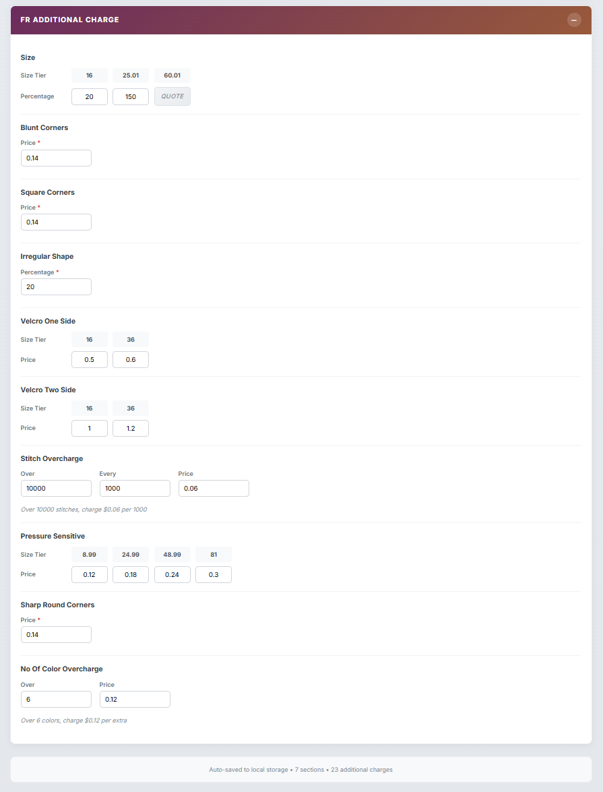

# Dynamic Pricing Management UI

An Angular 21 application that takes a complex pricing JSON file and turns it into an interactive, editable dashboard. Each price cell is backed by a WritableSignal, so edits are instant and the entire state auto-saves to localStorage.


**Live Demo:** https://dynamic-pricing-one.vercel.app

## Screenshots

### All sections collapsed


### FR section - size-based pricing matrix (9 sizes x 10 quantity tiers)


### Fancy, Hi Vis, and Default sections expanded


### Inserts, Reflective (notice the N/A badge), and Fancy Inserts


### Additional charges - covers fixed price, percentage, tiered, and formula-based types


### FR-specific additional charges


## How to run

```
npm install
ng serve
```

Then open http://localhost:4200/.

## What it does

- Parses pricing.json and renders 7 pricing sections (flat rows + a 2D FR matrix)
- Every value is editable - prices, tiers, discounts, and charge parameters
- Columns can be added or removed dynamically; row alignment is always maintained
- Handles sentinel values like dropout, n/a, and quote - these show up as grey read-only badges instead of input fields
- Saves changes automatically to localStorage with a 300ms debounce
- Reset to Default wipes localStorage and reloads from the original JSON

## Architecture

```
PricingContainerComponent
+-- PricingSectionComponent (x 7 sections)
|   +-- PricingRowComponent (x rows per section)
|   |   +-- PricingCellComponent (x columns)
|   +-- Discount input
+-- AdditionalChargesComponent (13 RUI-level charges)
+-- AdditionalChargesComponent (10 FR-level charges)
```

Everything is a standalone component. State lives in two services:

- **PricingNormalizerService** - pure function that converts raw JSON into the signal-based model. No side effects.
- **PricingStateService** - holds all the WritableSignals, handles add/remove columns, serialization, and the auto-save effect().

## File structure

```
src/app/
+-- app.ts, app.config.ts
+-- pricing/
    +-- pricing.types.ts              (interfaces for cells, rows, sections, charges)
    +-- pricing-normalizer.service.ts (JSON to signal model)
    +-- pricing-state.service.ts      (state management + persistence)
    +-- pricing-container/            (root component, loads JSON)
    +-- pricing-section/              (collapsible section with tier table)
    +-- pricing-row/                  (label + array of cells)
    +-- pricing-cell/                 (editable input or sentinel badge)
    +-- additional-charges/           (renders 6 different charge sub-types)
```

## Edge cases

- Sentinel values like dropout, n/a, quote are strings mixed into number arrays. Detected during normalization and rendered as non-editable badges.
- Some price arrays are shorter than item_tier arrays. These get padded with 0 to match.
- You cant remove the last remaining column (guarded).
- Corrupted localStorage is caught by try/catch, falls back to the raw JSON.

## Tech used

- Angular 21 with standalone components and zoneless change detection
- Signals API (signal, effect, WritableSignal, input())
- Built-in control flow (@if, @for, @switch)
- TypeScript strict mode
- Vanilla CSS with Inter font from Google Fonts
